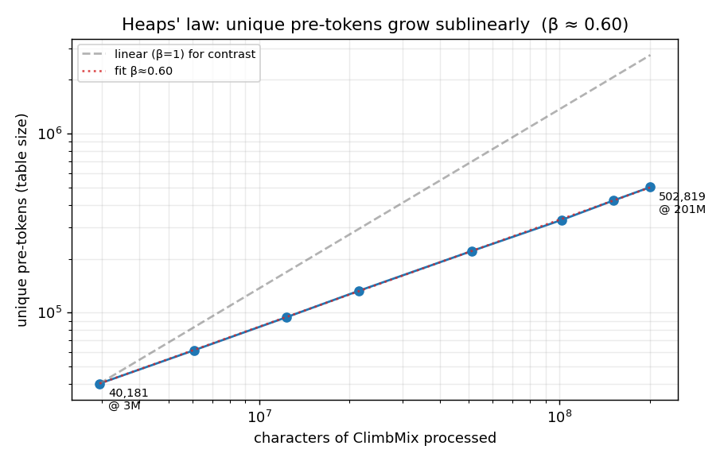
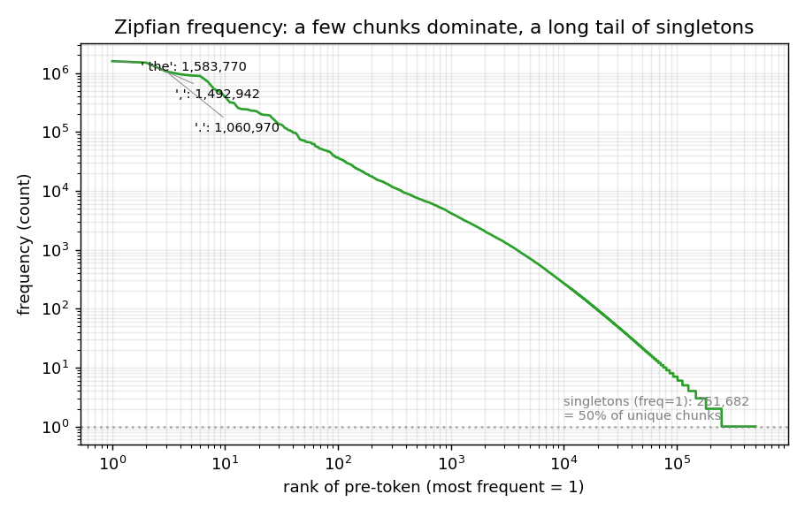

# Chapter 5 — The BPE Merge Loop

> The promise from [Ch04](04_bpe_and_byte_vocabulary.md) paid off: this is the actual
> training algorithm. **Repeat `vocab_size − 256 − num_special` times: find the most
> frequent adjacent pair of tokens across the corpus, mint a new token for it, and
> replace every occurrence.** The whole learned model is one dict: `(left_id, right_id)
> → new_id`. We watch it run on a tiny corpus, then on real ClimbMix data (32,503
> merges in **7.96s** on CPU), and unpack the three tricks that make it fast.
>
> Prereq: [Ch03](03_pretokenization.md) (the regex walls) and
> [Ch04](04_bpe_and_byte_vocabulary.md) (the byte vocabulary, the vocab math). Next:
> [Ch06](06_encoding_and_evaluation.md) (encoding + evaluation). Foundational:
> [Sennrich et al. 2016](https://arxiv.org/abs/1508.07909), Karpathy's
> [minbpe](https://github.com/karpathy/minbpe), and the actual trainer
> [karpathy/rustbpe](https://github.com/karpathy/rustbpe).

## The one-sentence algorithm

> Training is a greedy loop: **pick the most frequent adjacent pair, give it the next id,
> replace it everywhere, repeat.** Each new token gets id `256 + step`, so id order = the
> order pairs were learned = (roughly) frequency rank.

Karpathy's own commit note on splitting `rustbpe` into its own repo is the key framing:
it's *"equivalent to minbpe"* algorithmically; *"all of its complexity is not
algorithmic … instead it is efficiency-related."* So there are two layers here: the
**simple algorithm** (this section) and the **efficiency machinery** (later). Both
produce identical output.

The core loop, from [rustbpe `train_core_incremental`](https://github.com/karpathy/rustbpe/blob/master/src/lib.rs#L205):

```rust
while merges_done < num_merges {
    let Some(mut top) = heap.pop() else { break };   // most frequent pair
    ...
    let new_id = 256 + merges_done;                  // mint new token
    self.merges.insert(top.pair, new_id);            // record pair -> id  (THE MODEL)
    for &word_idx in &top.pos {                       // replace it everywhere
        let changes = words[word_idx].merge_pair(top.pair, new_id);
        ...                                           // patch pair counts incrementally
    }
    merges_done += 1;
}
```

The entire trained artifact is `self.merges`. Everything else (the byte strings, the
ranks fed to tiktoken) is *reconstructed* from it — see [Ch06](06_encoding_and_evaluation.md).

## What the loop trains on: a counted table, not a token stream

A crucial setup step happens *before* the loop. The raw text is **not** fed in as a flat
sequence. It is collapsed into **unique pre-tokenization chunks with frequency counts**.

```
ClimbMix docs ──pre-tok regex (Ch03)──► ordered chunk lists ──count──► {chunk: count}
"the cat sat on the mat" → ['the',' cat',' sat',' on',' the',' mat']
                           then tallied across the whole corpus into a table
```

So `' cat'×3` is stored once with weight 3, never expanded. Every pair count below is
**weighted by the chunk's count** ([lib.rs:147](https://github.com/karpathy/rustbpe/blob/master/src/lib.rs#L147)).
This is the single most important efficiency idea, and it's measurable.

### Measured: how big is that table? (real ClimbMix)

Counting unique chunks on the shard in `base_data_climbmix`:

| Chars processed | Total chunks | **Unique chunks** (table size) | Dedup |
|---|---|---|---|
| 12M | 2.4M | 94,310 | 25× |
| 51M | 10.0M | 221,015 | 45× |
| 102M | 19.9M | 329,293 | 60× |
| 201M | 39.2M | **502,819** | **78×** |

Two facts fall out, both interview-grade:

- **Unique chunks grow *sublinearly*** ([Heaps' law](https://en.wikipedia.org/wiki/Heaps%27_law),
  `unique ≈ K·N^β`, here β ≈ 0.59 measured). 16.7× more data → only 5.3× more unique
  chunks. Extrapolated to the full **2B-char** tokenizer training: **~1.9M unique chunks**
  vs ~400M total occurrences — so the merge loop processes ~2M rows, not 400M tokens.
- **Half the table is singletons.** At 200M chars, **50.1%** of unique chunks appear
  exactly once (typos, rare numbers, non-English fragments). They sit in the table but
  almost never win a merge. This long tail is why unique-count keeps creeping up while the
  *useful* vocabulary saturates — and **why the tokenizer trains on only ~2B chars, not the
  full 400B**: more data mostly re-sees `' the'` and adds singletons.



*Measured on the real shard (log-log). Unique pre-tokens track the **fitted β≈0.60** line, far
below the dashed **linear (β=1)** reference — every 10× more text yields only ~4× more unique
chunks. This sublinear growth is what makes the merge loop's per-iteration cost bounded.*



*The same chunks, ranked by frequency (log-log) — a textbook **Zipf** curve. A handful of
chunks (`' the'`, `,`, `.`) carry millions of occurrences each, while the tail flattens onto a
floor of **251,682 singletons (50%)**. The head merges early and cheaply; the singleton tail
fills the table but rarely wins a merge.*

> **Q:** Why dedup into a table at all — why not just merge over the token stream?
>
> **A:** Two reasons. **Speed:** the same chunks (`' the'`, `' of'`, `'ing'`) repeat
> billions of times; counting them once with a weight turns a 400M-occurrence problem into
> a ~2M-row one. **The walls for free:** the table's *keys are the chunks*, and merges only
> ever happen *inside* a key — so the Ch03 pre-tokenization boundaries become hard fences
> that BPE structurally cannot cross.

## One iteration, in full (real trace on a tiny corpus)

Take three sentences so we can watch every number:
`"the cat sat on the mat"`, `"the cat sat"`, `"a cat and a hat"`. After the table is
built, each chunk is a **list of byte-ids** (the initial vocab, ids 0–255 = raw bytes):

```
'the'  (x2) -> [116, 104, 101]      ['t','h','e']
' cat' (x3) -> [32, 99, 97, 116]    [' ','c','a','t']
' sat' (x2) -> [32, 115, 97, 116]   [' ','s','a','t']
...
```

Each iteration is **4 sub-steps**:

**(1) Tally every adjacent pair, weighted by chunk count.** Slide a 2-wide window over
each id-list; add the chunk's count to each pair seen:

```
('a','t') : 7     ← ' cat'(3) + ' sat'(2) + ' mat'(1) + ' hat'(1)
('t','h') : 3     ('h','e') : 3     (' ','c') : 3     (' ','a') : 2     ...
```

`('a','t')` = 7 because it lives in four different chunks; counts sum across all of them.

**(2) Pick the winner: highest count, ties broken by smallest id-pair.** `('a','t')` at 7.

**(3) Mint a new token:** `new_id = 256 + step`. Step 0 → id **256**, recorded in the model:

```
merges[(97,116)] = 256        # 'a'+'t' -> 'at'
```

**(4) Replace the pair everywhere** it occurs, rewriting each id-list:

```
' cat' (x3) -> [32, 99, 256]    [' ','c','at']    # 'a','t' fused
' sat' (x2) -> [32, 115, 256]   [' ','s','at']
'the'  (x2) -> [116, 104, 101]  unchanged          # had no 'a','t'
```

Then **loop back to (1)** on the rewritten corpus. The first six merges learned:

```
merge 0: ('a','t')   count=7  -> 256 'at'
merge 1: (' ','c')   count=3  -> 257 ' c'
merge 2: ('h','e')   count=3  -> 258 'he'
merge 3: ('t','he')  count=3  -> 259 'the'     ← composes on merge 2 (id 258)
merge 4: (' c','at') count=3  -> 260 ' cat'    ← composes on TWO learned tokens (257,256)
merge 5: (' ','a')   count=2  -> 261 ' a'
```

Three things this makes concrete:

- **Counts sum across chunks** (the `at`=7 above).
- **ids encode frequency rank** — `at` was most frequent → lowest id 256. This *is* the
  "lower id ≈ more frequent" claim from Ch04, derived: `new_id = 256 + step`.
- **Merges compose into a tree.** Merge 3 builds `'the'` from `'t'+'he'` where `'he'` was
  itself merge 2; merge 4 builds `' cat'` from two *learned* tokens, no raw bytes left. The
  next tally sees brand-new pairs like `('c','at')` that didn't exist before — that's how
  multi-byte tokens grow.

## What changes and what doesn't

A common confusion, worth stating flatly:

| Structure | What it is | Changes during the loop? |
|---|---|---|
| **The chunk table** `{chunk: count}` | `' cat': 3`, … | **No — frozen.** Counts and keys never change. |
| **Each chunk's id-list** | `[32,99,97,116]` → `[260]` | **Yes — rewritten each merge.** Only ever *shrinks*. |
| **`merges` dict** | `(l,r) → id` | **Grows by 1** per iteration (the output). |

So: initially every chunk is byte-by-byte; each merge fuses a pair to a new id wherever it
appears; the chunk text and its count stay fixed; its id-list gets one slot shorter.

## Tie-breaking = determinism (it actually happened)

Iteration 1 above had a 4-way tie at count 3:

```
('t','h')  : 3  -> ids (116,104)
('h','e')  : 3  -> ids (104,101)
(' ','c')  : 3  -> ids ( 32, 99)   ← smallest tuple, WINS
('c','at') : 3  -> ids ( 99,256)
```

The rule (real rustbpe, [lib.rs:122](https://github.com/karpathy/rustbpe/blob/master/src/lib.rs#L122)):
highest count; on a tie, **smallest `(left_id, right_id)`**. `(32,99)` beat the others → id
257 went to `' c'`.

> **Q:** Does *which* tied pair we pick affect quality?
>
> **A:** Almost not at all. The point isn't the choice, it's that the rule is
> **deterministic**: same corpus → same merges → same token ids, every run, every machine.
> Without it, dict/heap iteration order could drift and break reproducibility (and any saved
> model that depends on exact ids). The value is arbitrary; the determinism is the point.

## The efficiency machinery (why 32,503 merges take seconds)

The naive loop above re-tallies **all** pairs and re-scans **all** chunks every iteration —
O(corpus × merges), hopeless at 2B chars. rustbpe keeps the *same algorithm and output* but
makes each iteration cheap with three tricks that only work **together**:

| Trick | Replaces | How |
|---|---|---|
| **Patch (incremental deltas)** | the full re-tally | a merge only changes pairs *touching the merge site*; emit ±1 deltas, apply to a *persistent* `pair_counts` |
| **Max-heap + lazy refresh** | the `max()` scan | pop the top pair in O(log n); stale entries are corrected when popped, not edited in place |
| **`where[pair]` index** | the full replace scan | only revisit the chunks that actually contain the winning pair |

**Patch.** Merging `(a,b)→Z` inside `…x a b y…` only deletes `(x,a),(a,b),(b,y)` and
creates `(x,Z),(Z,y)`. Everything else is untouched. `merge_pair` returns exactly these
deltas ([lib.rs:57](https://github.com/karpathy/rustbpe/blob/master/src/lib.rs#L57)):

```rust
deltas.push(((x, a), -1)); deltas.push(((x, new_id), 1));   // left
deltas.push(((a, b), -1));                                   // self
deltas.push(((b, y), -1)); deltas.push(((new_id, y), 1));   // right
```

They're applied to a living `pair_counts` (weighted by chunk count) — **no full recount**.

**Heap + lazy refresh.** Patching makes counts drift, but a heap can't cheaply "decrease-key"
a buried entry. So stale entries are left in and fixed on pop ([lib.rs:210](https://github.com/karpathy/rustbpe/blob/master/src/lib.rs#L210)):

```python
neg, pair = heap.pop()
live = pair_counts[pair]
if live <= 0:        continue              # pair died -> discard
if -neg != live:     heap.push((-live, pair)); continue   # stale -> requeue corrected
# else fresh -> it's the true winner
```

> **The heap and the patch are a package, not à la carte.** The heap only pays off because
> the tally *persists* across iterations — and it only persists because we patch it. The
> heap optimizes exactly one step: finding the argmax (O(n) scan → O(log n) pop).

The headline consequence:

```
NAIVE:      every iteration: re-count ALL pairs + scan for max     (O(corpus) × 32,503)
EFFICIENT:  ONCE at startup: count all pairs + build heap
            every iteration: pop max  →  patch only what the merge touched
```

**After the one-time initial count, no iteration ever counts from scratch.** That is the
whole speedup.

## Scale: it's CPU-bound and tiny in memory

Measured working set for the table + id-lists at 200M chars (502,819 unique chunks), naive
Python:

```
count table {str:int}   : 199 MB   (dominated by half a million Python string keys)
id-lists + counts       :  70 MB   (ints 0-255 are interned singletons -> cheap)
TOTAL                   : ~270 MB
```

Extrapolated to the full 2B-char run: ~1.5 GB in naive Python; **a few hundred MB in Rust**
(`CompactString` keys, packed `Vec<u32>` ids, `AHashMap`). No GPU, no neural weights — just a
counted table dragged through 32K cheap iterations.

> **Interview line:** *"BPE training is CPU-bound and small in memory. The trick is
> deduplicating the corpus into a counted table of ~1–2M unique pre-tokens, so each of the
> ~32K merge iterations touches that table — patched incrementally with a heap — instead of
> the raw billions of tokens."*

## The output, on real data

Training [`scripts.tok_train`](../scripts/tok_train.py) on ~250M chars of ClimbMix:

```
Finished training: 32503 merges completed
vocab_size: 32,768        Training time: 7.96s
```

The learned `merges`, read in id order, *are* the language's frequency structure. The first
six on real ClimbMix:

```
b' t'→256   b' a'→257   b'in'→258   b'he'→259   b're'→260   b'on'→261
```

— the highest-frequency English bigrams. (Compare the toy corpus, where `'at'`/`' c'` won
first: on real text the universal English pairs dominate.) The full top→bottom progression
(short frequent fragments → long rare words) is read in [Ch06](06_encoding_and_evaluation.md).

## Verification: our Python == the real rustbpe

To certify the algorithm, we ran our naive Python trainer and the real `rustbpe.Tokenizer`
on the *same* 3-sentence corpus (vocab 268 = 256 + 12). **All 12 learned merges were
byte-for-byte identical** (`b'at'`, `b' c'`, `b'he'`, `b'the'`, `b' cat'`, …). The naive
loop and the fast Rust trainer are the same algorithm — confirming Karpathy's "equivalent to
minbpe" claim, with the efficiency machinery changing only *speed*, never *output*.

---

*Next: [Ch06](06_encoding_and_evaluation.md) — how this `merges` table is used at inference
to tokenize new text, what the three saved artifacts are, and how the tokenizer is evaluated
(compression ratio and bits-per-byte).*
