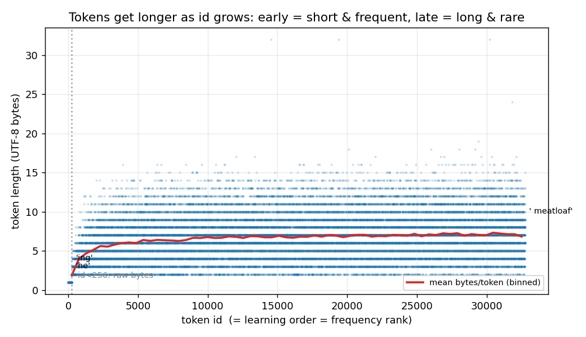
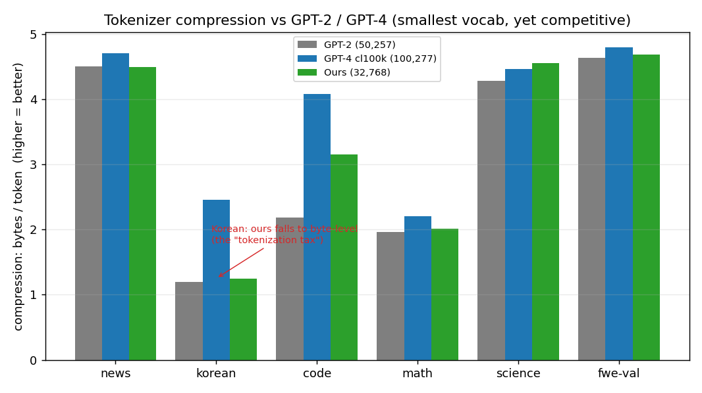

# Chapter 6 — Encoding and Evaluating the Tokenizer

> Training produced one dict, `merges`. This chapter uses it: how new text is **encoded**
> (replaying merges), what the tokenizer **saves to disk** (exactly three things), and how
> it's **evaluated** two different ways — *compression* (bytes/token, the tokenizer alone)
> and *bits-per-byte* (the fair, vocab-invariant model metric that `token_bytes.pt` enables).
>
> Prereq: [Ch05](05_bpe_merge_loop.md) (the merge loop, the `merges` output). Next: the
> model chapters (pretraining + eval). Code: [`tokenizer.py`](../nanochat/tokenizer.py),
> [`tok_eval.py`](../scripts/tok_eval.py), [`loss_eval.py`](../nanochat/loss_eval.py).

## Encoding: replay the merges on new text

> Encoding is the mirror of training. **Split text with the same regex, then for each
> chunk replay the learned merges, always applying the earliest-learned (lowest `new_id`)
> applicable merge first, until none apply.**

The algorithm ([rustbpe `encode`](https://github.com/karpathy/rustbpe/blob/master/src/lib.rs#L460)):

```
1. split text with the SAME regex used in training  (Ch03)
2. each chunk -> raw bytes
3. repeatedly apply the lowest-new_id applicable merge until the chunk can't reduce further
```

Worked on a brand-new sentence with our tiny 12-merge toy tokenizer:

```
'the cat ate a rat'  ->  ['the', ' cat', ' ate', ' a', ' rat']   (regex split)

'the'  : ['t','h','e']    → ['t','he']    → ['the']         = 1 token  (seen)
' cat' : [' ','c','a','t'] → [' ','c','at'] → [' c','at'] → [' cat']  = 1 token  (seen)
' ate' : [' ','a','t','e'] → [' ','at','e']  ← only 'at' applies, then STUCK = 3 tokens (novel)
' rat' : [' ','r','a','t'] → [' ','r','at']  ← 'r' has no merge, stays a byte  = 3 tokens (novel)
```

Two behaviors, both important:

- **Seen words collapse to one token**, rebuilding their training-time composition
  bottom-up (`' cat'` = `at` then `' c'` then `' cat'`).
- **Novel words degrade gracefully to fragments + bytes** — `ate`, `rat` were never seen,
  so they fall back to whatever sub-pieces *were* learned (`at`) plus raw bytes.
  **There is no `<unk>`, ever** — worst case is bytes (the Ch04 guarantee).

### The key asymmetry (great interview point)

> **Training picks the most *frequent* pair. Encoding picks the earliest-*learned* pair
> (lowest `new_id`).** At inference there are no corpus frequencies — just one short chunk —
> so it replays the merge rules in learned order. Since `new_id = 256 + step`, "lowest id"
> = "learned first" = "was most frequent in training." Encoding deterministically
> reconstructs what training would have built. (`rustbpe`: *"always merge the pair with the
> lowest new_id first"*, [lib.rs:477](https://github.com/karpathy/rustbpe/blob/master/src/lib.rs#L477).
> tiktoken does the same, heavily optimized.)

### The loop nesting

Encoding a batch is three nested loops, each level independent (so it parallelizes):

```
for sentence in inputs:                 # 1) each input string
    for chunk in regex_split(sentence): # 2) each pre-token chunk
        while a learned merge applies:  # 3) reduce the chunk to a fixpoint
            apply lowest-new_id merge
```

There's no cross-talk: chunks never merge across boundaries; inner reduction touches only
its own chunk. The number of inner steps ≈ how much that chunk compresses.

### Toy vs real: the same sentence

The toy (12 merges) shattered `"the cat ate a rat"` into **9 tokens**. The **real** 32K
tokenizer (trained on 250M chars, [Ch05](05_bpe_merge_loop.md)) gives **5 tokens** — one per
word:

```
real:  'the cat ate a rat'  ->  [1238, 1065, 12421, 257, 3577]
                                 ['the',' cat',' ate',' a',' rat']
```

It *learned* `ate` and `rat` as whole tokens. **Token count tracks how much the tokenizer
has seen** — the same string costs fewer tokens the more text the tokenizer was trained on.

## What gets saved: exactly three things

Inference needs only: **the merges, the pre-tokenization regex, and the special tokens.**
nanochat persists these as a pickled `tiktoken.Encoding`
([`save`, tokenizer.py:258](../nanochat/tokenizer.py#L258)), plus one eval helper:

```
.nanochat/tokenizer/
  tokenizer.pkl    402K   the tiktoken Encoding  (the model)
  token_bytes.pt   130K   per-token byte counts  (an eval helper, see below)
```

Reading `tokenizer.pkl`:

```
n_vocab = 32768
mergeable_ranks : dict[bytes -> rank]   32759 entries  (256 bytes + 32503 merges)
pat_str         : the GPT-4-style split regex          (Ch03)
special_tokens  : {'<|bos|>': 32759, '<|user_start|>': 32760, ...}   (9, at the top)
```

- **`mergeable_ranks` is the merges in byte-string form.** First 256 ranks are the raw
  bytes; ranks 256+ are the learned merges in priority order. The id→bytes vocab is *not*
  stored separately — it's reconstructed by replaying merges in id order
  ([`get_mergeable_ranks`, lib.rs:429](https://github.com/karpathy/rustbpe/blob/master/src/lib.rs#L429)),
  then handed to tiktoken ([tokenizer.py:180](../nanochat/tokenizer.py#L180)).
- **The regex travels *with* the model.** A tokenizer is `merges + the split pattern`;
  without the same regex at encode time, merges apply to differently-split text and give
  wrong tokens.
- **The 9 specials sit at the top** (ids 32759–32767), appended after the 32759 learned
  tokens — exactly the Ch04 vocab arithmetic (256 + 32503 + 9 = 32768 = 2¹⁵).

> **Q:** Why is the whole model only 402K?
>
> **A:** Because it's *just a vocabulary* — ~32K byte-strings plus ranks plus a regex. No
> neural weights, no training state. The trained tokenizer is a lookup table.

### Reading the merges top-to-bottom = the frequency structure

The real learned vocabulary, sampled by id:

| id range | Example tokens | Bytes | What they are |
|---|---|---|---|
| 256–275 | `' t' 'in' 'he' 're' ' the' 'ing'` | 2–4 | most frequent English bigrams/trigrams |
| ~1,000 | `' call' ' before' '--' ' Un'` | 2–7 | short common / partial words |
| ~16,000 | `' financing' ' periodically' ' datasets'` | 9–14 | full ordinary words |
| ~32,750 | `' meatloaf' ' pickled' ' Martha' 'hao'` | 3–13 | long, rare, specific (incl. the multilingual tail) |
| 32,759–767 | `<\|bos\|> …` | 0 | the 9 specials |

**Token byte-length grows with id**: early merges fuse 2 bytes, late ones fuse whole long
words (each merge stacks on previous ones — the composition tree, across 32K ids). And
**id ≈ inverse frequency**: `' the'` got id 262, `' meatloaf'` got 32753, because of
`new_id = 256 + step`. The bottom merges had training frequencies of ~108 — the long-tail
singletons from [Ch05](05_bpe_merge_loop.md) that barely cleared the bar. (`'hao'`, the very
last merge, is a fragment of romanized `你好` — the multilingual tail explored in
[Ch07](07_tokenization_deep_dives.md).)



*Every one of the 32,768 tokens, plotted by id vs its UTF-8 byte length (real trained
tokenizer). The horizontal stripes are the integer byte-lengths; the red **binned mean** climbs
fast from ~2 bytes (the earliest, most frequent merges like `'he'`) and saturates around ~7
bytes — early tokens are short frequent fragments, later ones are longer rarer words (out to
`' meatloaf'` and a 32-byte maximum). The dotted line at id 256 marks the raw-byte base
vocabulary.*

## Evaluation #1: compression ratio (the tokenizer alone)

[`scripts.tok_eval`](../scripts/tok_eval.py) round-trips a battery of diverse texts through
GPT-2, GPT-4 (`cl100k`), and ours, asserts every decode matches
([line 182](../scripts/tok_eval.py#L182), proving losslessness), and reports:

```python
ratio = len(text_bytes) / len(encoded_tokens)     # bytes per token; HIGHER = more efficient
```

This judges the **tokenizer alone**, and it matters: fewer tokens = cheaper training/inference
(compute scales with token count) and longer effective context.

Real results (32K vocab, our run; full log saved to `.nanochat/tok_eval_results.txt`):

```
Vocab:  GPT-2 = 50,257    GPT-4 = 100,277    Ours = 32,768   (ours is the SMALLEST)

vs GPT-2 (ours better by):  code +30.7%   science +6.2%   korean +4.2%   math +2.7%
                            fwe-val +1.2%   news -0.2% (tie)
vs GPT-4 (ours vs):  korean -96.2%   code -29.1%   math -9.5%   news -4.7%
                     fwe-val -2.2%   science +2.0% (ours wins)
```

Reading one row:

```
code   1259 bytes   GPT-2: 576 tok / 2.19   Ours: 399 tok / 3.16   +30.7%   Ours
                    └ same text, ours uses 177 fewer tokens = 30% less compute
```



*Bytes-per-token (higher = better) across text types, real `tok_eval` numbers. Our **green**
bars (smallest vocab, 32K) stay level with or beat GPT-2 (gray) everywhere, and rival GPT-4
(blue) on English/science — but collapse on **Korean**, where ours falls to byte-level while
GPT-4's multilingual vocab holds up. That gap is the "tokenization tax."*

What the numbers teach:

- **Ours beats GPT-2 almost everywhere despite a *smaller* vocab.** Two reasons: the
  **modern GPT-4-style split regex** (Ch03) handles code/whitespace/numbers far better than
  GPT-2's older pattern (the +30.7% on code), and **distribution match** — ours trained on
  the same ClimbMix family being evaluated.
- **Ours trails GPT-4 — as expected** (3× the vocab + huge multilingual/code data) — but
  stays within a couple percent on English/web and even **wins on science** (+2.0%).
- **The Korean cliff (−96.2%) = the "tokenization tax."** Trained on mostly-English data,
  ours barely learned Korean, so it falls back to bytes (ratio 1.25 ≈ 1 byte/token) vs
  GPT-4's 2.45. Korean text costs ~2× the tokens → ~2× the cost. (The fairness subject of
  [Ch07](07_tokenization_deep_dives.md#multilingual-the-tokenization-tax).)
- **No train/val overfitting.** `fwe-train` ratio 4.74 vs `fwe-val` 4.69, beating GPT-2 by
  +1.4% / +1.2% — the learned merges generalize, they didn't memorize.

## Evaluation #2: bits-per-byte (the fair model metric)

This one belongs to *model* eval ([`loss_eval.py`](../nanochat/loss_eval.py),
[`base_eval.py`](../scripts/base_eval.py)), but its enabler — `token_bytes.pt` — is built
here at tokenizer-training time ([tok_train.py:72](../scripts/tok_train.py#L72)). So we set it
up now.

### The problem it solves

A language model's loss is its **surprise** at the next token (cross-entropy / negative
log-likelihood). But **per-token** surprise depends on the tokenizer: coarse tokens → fewer,
harder guesses → higher per-token loss; fine tokens → many easy ones. So per-token loss (and
its exponential, **perplexity**) is **not comparable across tokenizers** — you'd be comparing
scissors, not brains.

### The fix: measure per *byte*, not per token

A given text has a **fixed** byte count no matter how it's sliced. And by the chain rule,
`Σ_t −ln p(x_t | x_<t) = −ln p(text)` depends only on the text, not the slicing. So dividing
surprise by **bytes** (fixed) instead of **tokens** (tokenizer-dependent) removes the
granularity effect. That metric is **bits-per-byte (BPB)**, and it's tokenizer-invariant.

To divide by bytes you need each token's byte length — that's **`token_bytes.pt`**, a length-
32768 `int32` tensor where entry *i* = UTF-8 byte length of token *i* (specials = 0). It's
cached as a device tensor purely for speed: in the eval loop it's a single gather
`num_bytes = token_bytes[y]` ([loss_eval.py:51](../nanochat/loss_eval.py#L51)), never a
per-token `decode()`.

The formula ([loss_eval.py:64](../nanochat/loss_eval.py#L64)):

```
BPB = total_nats / (ln(2) · total_bytes)
      └ Σ surprise in nats        └ ln(2) converts nats→bits;  total_bytes = Σ token_bytes[x_t]
```

- **nat** = surprise under natural log; **bit** = under log₂ (`1 nat ≈ 1.4427 bits`). PyTorch
  computes loss in nats; dividing by `ln(2)` reports it in human-friendly **bits**.
- **BPB = average yes/no questions to predict each byte.** Lower = smarter; random = 8.0
  (a byte = 8 bits); good English LMs ≈ 0.9–1.1.

### The two evals, contrasted

```
COMPRESSION (tok_eval):  bytes ÷ tokens.   HIGHER better.   judges the SCISSORS (tokenizer).
BITS-PER-BYTE (base_eval, needs token_bytes.pt):  surprise(bits) ÷ bytes.   LOWER better.
                                                  judges the BRAIN (model), tokenizer-fairly.
```

| Metric | Per | Comparable across tokenizers? | Used by |
|---|---|---|---|
| Perplexity | token | ❌ no | (within one model) |
| **Bits-per-byte** | byte | ✅ yes | [base_eval.py](../scripts/base_eval.py) (model) |
| Compression ratio | token | (it *is* the tokenizer comparison) | [tok_eval.py](../scripts/tok_eval.py) |

> **Interview answer — "Why bits-per-byte instead of perplexity?"** Perplexity is per-token,
> and token size depends on the tokenizer, so it's not comparable across vocabularies. BPB
> normalizes by bytes — a fixed property of the text — isolating the model's predictive
> quality from the tokenizer's granularity. `token_bytes.pt` is just the precomputed
> byte-count lookup that makes the per-byte division cheap.

---

*That closes the tokenization pipeline: train ([Ch05](05_bpe_merge_loop.md)) → encode →
save (3 artifacts) → evaluate (compression + BPB), all on real runs. The frontier companion
— multilingual fairness, morphology, SuperBPE, byte/pixel models — is
[Ch07](07_tokenization_deep_dives.md). Next in the core path: the transformer model and
pretraining.*
