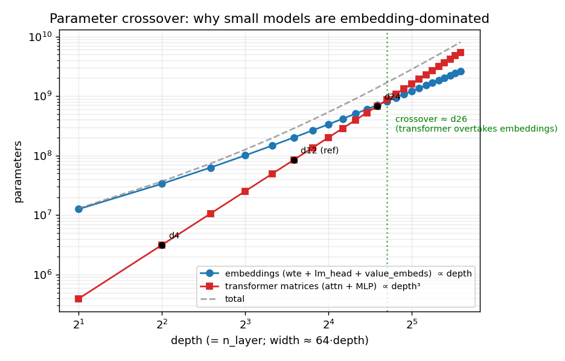
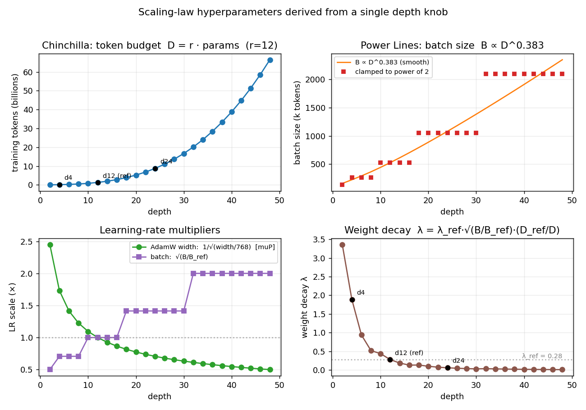

# Chapter 8 — Sizing the Model: Config, Parameters & Scaling Laws

> Before any architecture math, this chapter answers a more basic question: **what shape is
> the model, and how is the training run configured?** nanochat's answer is striking — you
> set *one* knob, `--depth`, and everything else (width, number of attention heads,
> parameter count, how many tokens to train on, the batch size, every learning rate, the
> weight decay) is *derived* from it via published **scaling laws**. We trace that whole
> derivation, grounded in a real depth-4 run on a Mac CPU.
>
> Prereq: the tokenizer chapters ([Ch04](04_bpe_and_byte_vocabulary.md)–[Ch06](06_encoding_and_evaluation.md))
> — the model's vocabulary size comes from there. Next: the architecture itself (attention,
> MLP, the forward pass) in the chapters that follow. Code:
> [`gpt.py`](../nanochat/gpt.py) (`GPTConfig`, `GPT.__init__`, `num_scaling_params`) and the
> scaling-law block of [`base_train.py`](../scripts/base_train.py#L249).

## The big idea: one knob + scaling laws

> **You don't hand-tune a model per size. You tune a reference model once (here, "d12"),
> then use scaling-law formulas to *predict* the right architecture and hyperparameters for
> any `depth`.** Taller models are automatically wider, trained on proportionally more data,
> with correspondingly adjusted batch size, learning rates, and weight decay.

This is why the smoke-test command was so short — almost everything was inferred.

## The config object

The full architecture spec is a small dataclass, [`GPTConfig`](../nanochat/gpt.py#L28):

```python
sequence_len   = 2048      # max context length (tokens the model can attend over)
vocab_size     = 32768     # from OUR tokenizer (Ch04-06)
n_layer        = 12        # number of transformer blocks  (== depth)
n_head         = 6         # number of query heads
n_kv_head      = 6         # number of key/value heads (GQA, below)
n_embd         = 768       # model width (size of each token's vector)
window_pattern = "SSSL"    # sliding-window attention layout (architecture chapter)
```

A few terms, expanded on first use:

- **`n_embd` ("number of embedding dimensions") = the model width** — the length of the
  vector that represents each token as it flows through the network. Bigger = more capacity.
- **`n_layer` = depth = the number of stacked transformer blocks.** "Depth" (the CLI/scaling
  word) and `n_layer` (the architecture word) are *the same number*.
- **GQA = Grouped-Query Attention** ([Ainslie et al. 2023](https://arxiv.org/abs/2305.13245)):
  an attention variant where there are fewer key/value heads (`n_kv_head`) than query heads
  (`n_head`), to save memory. Here they're equal (no grouping); the mechanism is the
  architecture chapter's job.

Notice the **defaults *are* the d12 reference model**: `n_layer=12, n_embd=768, n_head=6`.
That's the model all hyperparameters are tuned on and transferred from.

## Depth is the only knob: how dimensions are derived

You never set width or head count directly. They fall out of `depth` in
[`build_model_meta`](../scripts/base_train.py#L133):

```
n_layer  = depth
n_embd   = ceil(depth · aspect_ratio / head_dim) · head_dim     # rounded to a multiple of head_dim
n_head   = n_embd / head_dim
head_dim = 128   (constant)
```

with the constants `aspect_ratio = 64` and `head_dim = 128`. Here **`head_dim` ("head
dimension") is the size of each attention head's vector**; nanochat keeps it *fixed at 128*
and makes the model wider by adding **more heads**, not bigger ones. Worked out for three
depths:

| | base_dim = depth·64 | `n_embd` (width) | `n_head` = width/128 | `n_layer` |
|---|---|---|---|---|
| **d4** (our run) | 256 | **256** | **2** | **4** |
| **d12** (reference) | 768 | 768 | 6 | 12 |
| **d24** (speedrun) | 1536 | 1536 | 12 | 24 |

So `--depth=4` gave exactly the `n_embd=256, n_head=2, n_layer=4` we saw printed. One number
slides the whole model up and down a fixed "aspect ratio" (width ≈ 64 × depth) — a deliberate
scaling-law convenience.

## The meta-device init (shapes before memory)

`GPT.__init__` runs under PyTorch's **`meta` device** — a "blueprint" device where tensors
have a **shape and dtype but no actual data in memory** (it is *not* cpu/cuda/mps). Think
architect's blueprint vs. the built house: you can measure every room without laying a brick.

This enables a 3-step materialization ([base_train.py:146-151](../scripts/base_train.py#L146)):

```python
model = build_model_meta(depth)   # 1) meta:    blueprint — 0 bytes allocated
model.to_empty(device=device)     # 2) cpu/gpu: allocate real storage (garbage contents)
model.init_weights()              # 3)          fill with proper initial values
```

> **Q:** Why bother with a fake device?
>
> **A:** Three wins. (1) **Free inspection** — count parameters and estimate compute before
> committing memory. (2) **A free reference** — base_train builds a throwaway *d12* model
> purely to read its parameter counts for the scaling laws ([base_train.py:272](../scripts/base_train.py#L272));
> on `meta` that costs nothing. (3) **No wasted init** — building on a real device would
> allocate *and* run default weight-init, only to be overwritten; `meta` skips straight to
> the real `init_weights()`.

## Parameter counts: why it's 91% embeddings at small depth

The model's parts ([`GPT.__init__`](../nanochat/gpt.py#L171)) map 1:1 to the parameter table.
Two of them are the big tables:

- **`wte` = "word token embeddings"** — the lookup table mapping each of the `vocab_size`
  token ids to a width-`n_embd` vector. Shape `vocab × n_embd`.
- **`lm_head` = "language-model head"** — the *unembedding*: maps a width-`n_embd` vector back
  to a score over all `vocab_size` tokens. Shape `n_embd × vocab`.

(The rest — `transformer.h` the stack of blocks, plus modern extras `value_embeds`, and the
learnable scalars `resid_lambdas`/`x0_lambdas`/smear/backout — are the architecture chapters.)

Measured counts from our **depth-4** run, every number explained:

```
wte                  =  vocab × n_embd   = 32768 × 256  =  8,388,608
lm_head              =  n_embd × vocab   = 256 × 32768  =  8,388,608
value_embeds         =  (modern extra, 2 layers)        = 16,777,216
transformer_matrices =  the 4 blocks (attention + MLP)  =  3,145,776
scalars              =  4+4+24+1+1                       =         34
                                                          ───────────
total                                                    = 36,700,242
```

The three embedding tables are **33.5M of 36.7M ≈ 91%**; the actual transformer is **8.6%**.

### Why — the width² vs. width crossover

The transformer's weight matrices map width→width, so each is `n_embd²`; the embedding tables
map vocab→width, so each is `vocab · n_embd`:

```
embeddings (wte, lm_head)  ∝  vocab · n_embd          (LINEAR in width)
transformer_matrices       ≈  n_layer · 12 · n_embd²  (quadratic in width)
```

The `12 · n_embd²` per block comes from ~`4·n_embd²` in attention (the Query, Key, Value,
Output projections) + ~`8·n_embd²` in the MLP (a `n_embd → 4·n_embd → n_embd` expansion) —
details in the architecture chapter. Since width itself grows with depth (`n_embd ≈ 64·depth`)
*and* layers grow with depth, the transformer scales like **depth³**, while embeddings scale
roughly **linearly**:

| | transformer (`∝ depth³`) | embeddings (`∝ depth`-ish) |
|---|---|---|
| d4 | 3.1M | 33.5M |
| d24 | ~680M | ~200M |

At small depth `vocab` (32,768) dwarfs width (256), so embeddings dominate; by d24 the `depth³`
term has overtaken.



*Computed from nanochat's real models (built on the meta device across depths, log-log axes).
The blue **embeddings** line has the shallower slope (grows ≈ linearly in depth); the red
**transformer** line is steeper (≈ depth³) and overtakes embeddings around **d26**. Our `d4`
sits far left where the model is 91% embeddings; the `d24` speedrun sits right at the
crossover.* This is exactly why [`num_scaling_params`](../nanochat/gpt.py#L345) reports
groups *separately*, and why scaling-law math uses **`transformer_matrices + lm_head`**, never
`total` — including the fixed-size vocab tables would distort the fit. (Historical note: the
original **[Kaplan et al. 2020](https://arxiv.org/abs/2001.08361)** scaling-laws paper excluded
embeddings for the same reason; **[Chinchilla](https://arxiv.org/abs/2203.15556)** included
them — [gpt.py:349](../nanochat/gpt.py#L349) cites both.)

## Hyperparameters derived from scaling laws

Once the parameter count is known, the training *configuration* is computed, not guessed
([base_train.py:249-310](../scripts/base_train.py#L249)). Each step cites a paper. Expanding
the terms as they appear:

**1) Training horizon — how many tokens to train on** ([Chinchilla](https://arxiv.org/abs/2203.15556)):

```
D (target tokens) = r · num_scaling_params       r = tokens-per-parameter ratio
```

**`D` is the token budget.** The **Chinchilla paper** (DeepMind, 2022) found a *compute-optimal*
ratio of ~20 tokens per parameter. nanochat defaults to `r=12`, and the speedrun deliberately
*undertrains* at `r=8` — fewer tokens than optimal, just enough to beat GPT-2, to save compute.

**2) Batch size — how many tokens per optimizer step** ([Power Lines](https://arxiv.org/abs/2505.13738)):

```
B = B_REF · (D / D_REF)^0.383          B_REF = 2^19 = 524,288 tokens (optimal at d12)
```

The **Power Lines paper** (2025) measured that the optimal batch size grows as the token budget
to the power **0.383**. `B_REF` and `D_REF` are the reference batch and budget at d12; a bigger
model → bigger budget → proportionally bigger batch.

**3) Learning rates — corrected for batch size and width.** Two corrections multiply together:

```
batch correction:  η ∝ (B / B_REF)^0.5             (square-root scaling: bigger batch → higher LR)
width correction:  η_adam ∝ 1 / √(n_embd / 768)    (muP transfer across width)
```

Here **`η` (eta) is the learning rate**; **AdamW = "Adam with decoupled Weight decay"**, the
optimizer used for the embedding parameters; and **muP = "Maximal Update Parametrization"** — a
recipe ([Yang et al.](https://arxiv.org/abs/2203.03466)) for setting learning rates so that
hyperparameters tuned on a small (narrow) model *transfer* to a wide one, the LR shrinking as
`1/√width`. (The matrix parameters use a different optimizer, **Muon** — its own chapter.)

**4) Weight decay — kept consistent via `T_epoch`** ([this paper](https://arxiv.org/abs/2405.13698)):

```
choose λ so that   T_epoch = B / (η · λ · D)   stays constant
```

**Weight decay `λ` (lambda)** is the regularization pulling weights toward zero. The cited paper
argues the quantity `T_epoch = B/(η·λ·D)` should stay fixed across scales, which pins how `λ`
must rescale once `B`, `η`, and `D` are set.

### Verified against our depth-4 log

Every derived number printed during the run checks out:

```
√(768 / 256)            = 1.732      → AdamW LR width correction        ✓
(512 / 524288)^0.5      = 0.0312     → batch LR correction              ✓
weight decay 0.28 → 0.0835          → T_epoch rescale for depth 4       ✓
```

### The whole chain, from one number

```
depth ─► architecture (width, heads, layers)
            └─► parameter count
                  └─► D = r · params                      [Chinchilla: data]
                        ├─► B = B_REF · (D/D_REF)^0.383    [Power Lines: batch]
                        │     ├─► η ∝ √(B/B_REF)           [sqrt LR-vs-batch]
                        │     ├─► η_adam ∝ 1/√width        [muP: LR-vs-width]
                        │     └─► λ keeps T_epoch constant [weight-decay paper]
                        └─► num_iterations = D / B
```



*All four panels computed from nanochat's real parameter counts and the exact `base_train.py`
formulas. **Top-left** — Chinchilla token budget grows super-linearly (params themselves grow
with depth). **Top-right** — Power-Lines batch size follows `D^0.383`, then snaps to the
nearest power of 2 (the staircase). **Bottom-left** — the two learning-rate multipliers: muP's
width correction (green, `1/√width`) shrinks while the batch correction (purple, `√(B/B_ref)`)
grows, and they cross at exactly **d12**, the reference, where both = 1.0. **Bottom-right** —
weight decay falls with depth to hold `T_epoch` constant. (These panels assume the
**auto-derived** batch size; our smoke test overrode it to 512, which is why its printed weight
decay was 0.0835 rather than the curve's d4 value.)*

The exponents (`0.383`, `0.5`, `1/√`) and the ratio `r` are empirical constants the papers
measured; nanochat hard-codes them and lets `depth` propagate.

> **Interview-ready summary:** nanochat sizes and configures a model from a single `depth`
> knob. Architecture: width ≈ 64·depth, with `head_dim` fixed at 128 so width is added as more
> heads. Hyperparameters: **Chinchilla** sets the token budget (`D = r·params`), **Power Lines**
> sets the batch size (`B ∝ D^0.383`), **muP** + square-root scaling set the learning rates, and
> a constant-`T_epoch` rule sets weight decay — all extrapolated from a tuned **d12** reference.

## A measurement aside: FLOPs per token

The script also estimates compute via [`estimate_flops`](../nanochat/gpt.py#L317) (our run:
`7.2e7` FLOPs/token). A **FLOP = floating-point operation**. The rule of thumb: each matmul
parameter costs **6 FLOPs per token** (2 for multiply-accumulate in the forward pass, 4 in the
backward pass — see the cited [FLOPs calculus](https://medium.com/@dzmitrybahdanau/the-flops-calculus-of-language-model-training-3b19c1f025e4)),
plus an attention term. This feeds the **MFU = "Model FLOPs Utilization"** readout (fraction of
the GPU's peak FLOPs actually used) — printed as `0.00` on our CPU run since MFU is only
meaningful on a GPU.

---

*Our smoke test **bypassed** the horizon/batch derivation by passing `--num-iterations=20` and
`--total-batch-size=512` directly — but the learning-rate and weight-decay rescales (step 3–4)
still ran, which is why those scaling printouts appeared. Next: the architecture itself — the
embeddings, attention, the transformer block, and the forward pass that turns token ids into
next-token predictions.*
