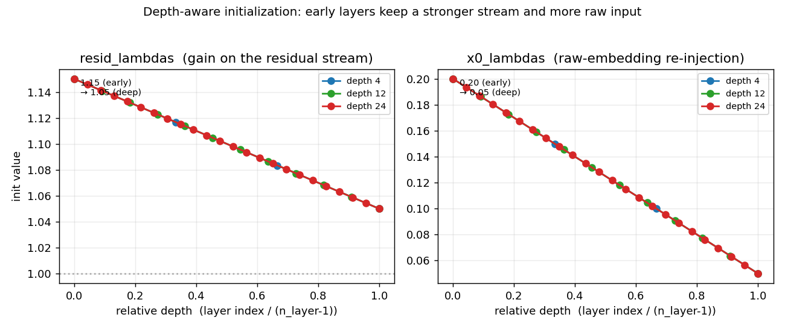

# Chapter 9 — Weight Initialization

> [Ch08](08_model_config_and_scaling.md) said *what* parameters exist and how many. This
> chapter is *how they start* — the values they're set to before any training. nanochat
> initializes the whole model in one readable function, [`init_weights`](../nanochat/gpt.py#L202),
> guided by two principles: **keep activations ~unit-variance going forward**, and **start the
> network neutral** (anything that writes a result begins at ~zero). The payoff is concrete and
> verifiable: the model's very first loss equals **`ln(vocab) = 10.40`**, exactly what our
> depth-4 run printed.
>
> Prereq: [Ch08](08_model_config_and_scaling.md) (the parameter groups). Next: [Ch10](10_embedding_stage.md)
> (the embedding stage — the first thing the forward pass does with these weights). Code:
> [`gpt.py:init_weights`](../nanochat/gpt.py#L202).

## Two principles

1. **Forward stability (fan-in scaling).** A matrix that maps a width-`d` vector to width-`d`
   sums `d` random products per output. To keep the output variance ≈ the input variance, the
   weights need `std ≈ 1/√d` ("fan-in" scaling, the Kaiming/Xavier idea). nanochat uses this for
   every "read" matrix.
2. **Neutral start (zero-init readouts).** Anything that **writes a result back** — the residual
   projections and the output unembedding — starts at **zero** (or ~zero). With residual
   connections (`x = x + f(x)`), a zero-init `f` means the block is initially a **no-op**, so the
   network begins as a stable near-identity and *learns outward* rather than un-learning random
   noise.

## The master table

Every parameter, from [`init_weights`](../nanochat/gpt.py#L202):

| Parameter | Init | Value / formula | Why |
|---|---|---|---|
| **Embeddings (lookups)** | | | |
| `wte` (token embed) | Normal | `std = 0.8` | O(1) input scale; RMS-normalized right after, so the exact value is low-stakes (empirically tuned) |
| `value_embeds` | Uniform | `±s` (same as `c_v`) | feeds attention's value path, so init like `c_v` |
| `lm_head` (unembed) | Normal | `std = 0.001` (≈0) | logits ≈ 0 → uniform softmax → **initial loss = ln(vocab)** |
| **Transformer matrices** *(detailed in the attention/block chapters)* | | | |
| `attn.c_q`, `c_k`, `c_v` | Uniform | `±s`, `s = √3 · n_embd^−0.5` | fan-in scaling; Uniform (not Normal) to avoid outliers |
| `mlp.c_fc` (up-proj) | Uniform | `±0.4·s` | fan-in, scaled 0.4× (empirical) |
| `attn.c_proj`, `mlp.c_proj` | **Zeros** | `0` | residual "writes" start neutral → block ≈ identity at init |
| **Per-layer scalars (mixing — see [Ch08](08_model_config_and_scaling.md))** | | | |
| `resid_lambdas` | Linear decay | `1.15 → 1.05` over depth | stronger residual early, weaker deep |
| `x0_lambdas` | Linear decay | `0.20 → 0.05` over depth | more raw-input blending in early layers |
| `smear_lambda` | Zero | `0` | smear **off** at start; learned on if useful |
| `backout_lambda` | Constant | `0.2` | mild mid-layer feature subtraction |
| `smear_gate.weight` | Uniform | `(0, 0.02)` | small **positive** → gate starts slightly open |
| `attn.ve_gate.weight` | Uniform | `(0, 0.02)` | value-embed gate starts slightly above neutral |
| **Non-learned** | | | |
| rotary `cos`/`sin` | Computed | `base = 100,000` | RoPE angles, not trained |

## The `ln(vocab)` payoff (verified from our run)

The `lm_head ≈ 0` choice is the most principled, and we can *prove* it. Trace the consequence:

```
lm_head ≈ 0  →  logits ≈ 0  →  softmax ≈ uniform over 32,768 tokens
             →  initial loss = −ln(1/vocab) = ln(32768) = 10.397
```

Our depth-4 smoke test's first step printed loss **`10.396720`**:

```
ln(32768) = ln(2^15) = 15 · ln2 = 10.397    vs    measured 10.3967    ✓
```

That near-exact match is the **signature of zero-init readout**. Why it matters: the model *should*
start predicting uniform (it knows nothing yet), and `ln(vocab)` is the theoretical "no
information" baseline. A large random `lm_head` would instead produce big arbitrary logits → a
huge, noisy initial loss → unstable early gradients. Starting at the baseline and growing
confidence is far more stable.

> **Interview-ready:** *"Why init the unembedding near zero? So the first-step logits are ~0,
> predictions are uniform, and the initial loss is exactly `ln(vocab)` — a correct, stable
> baseline — instead of a noisy random one. You can read it straight off the loss curve."*

## The `√3` trick (Uniform with the same std as Normal)

The matrices use `Uniform(−s, s)` with `s = √3 · n_embd^−0.5`, not `Normal`. Why `√3`? A
`Uniform(−a, a)` has standard deviation `a/√3`. Setting `a = √3 · n_embd^−0.5` gives it the **same
std** as `Normal(0, 1/√n_embd)` — i.e. proper fan-in scaling — but **bounded**, so there are no
rare large-magnitude weights ([gpt.py:223](../nanochat/gpt.py#L223), comment: *"Uniform to avoid
outliers"*). Same variance, fatter-tailed safety.

## Depth-aware scalar schedules

Two of the scalars aren't single values but **per-layer schedules** computed from `n_layer`
([gpt.py:235-239](../nanochat/gpt.py#L235)):

```
resid_lambdas[i] = 1.15 − 0.10 · i/(L−1)      # 1.15 (first layer) → 1.05 (last)
x0_lambdas[i]    = 0.20 − 0.15 · i/(L−1)      # 0.20 (first layer) → 0.05 (last)
```



*Both schedules are linear in relative depth and identical in shape across model sizes (depth 4 /
12 / 24 overlap). The prior they encode: **early layers keep a stronger residual stream
(`resid`>1) and blend in more of the raw token embedding (`x0`)**; deep layers taper toward a
neutral `resid≈1.05` and minimal raw-input injection. For our depth-4 run: `resid =
[1.15, 1.117, 1.083, 1.05]`, `x0 = [0.20, 0.15, 0.10, 0.05]`. (What these scalars **do**
mechanically is the Block chapter; here we only catalogue how they **start**.)*

## A reminder: init runs *after* the meta-device build

From [Ch08](08_model_config_and_scaling.md): the model is constructed shapes-only on the `meta`
device, then materialized in three steps — `build_model_meta` (blueprint) → `to_empty` (allocate
garbage) → **`init_weights`** (this chapter, fill with the values above). So everything in the
table is applied in that third step, [gpt.py:202](../nanochat/gpt.py#L202).

## The through-line

```
INPUT  side:  wte      std 0.8     → O(1), normalized anyway   ("read in")
              c_q/c_k/c_v, c_fc      → fan-in ±s (√3 trick)      ("read/transform")
OUTPUT side:  lm_head  std 0.001   → ~0, uniform predictions     ("read out")
              c_proj   zeros        → ~0, neutral residual        ("write back")
              smear_lambda zeros    → smear off                   ("disabled")
```

> **One line:** inputs enter at unit scale, everything that *writes a result* starts at zero, and
> the depth-aware λ schedules give early layers a slightly stronger stream — so the network begins
> as a stable near-identity that predicts uniform (loss `= ln(vocab)`) and learns outward.

---

*Next: [Ch10](10_embedding_stage.md) — the embedding stage, where the forward pass turns token ids
into vectors using these freshly-initialized weights.*
